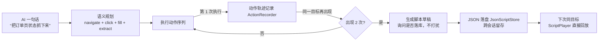
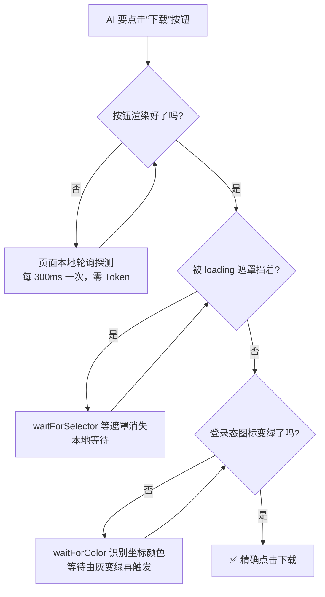
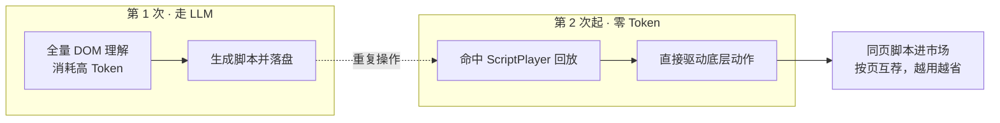
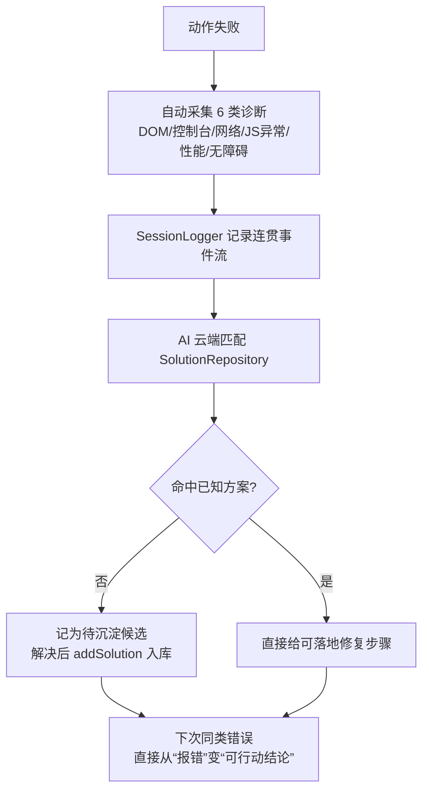

<div align="center">

# 🚀 OpenLiulan · 开放浏览

> **开「浏览」之眼，赋「AI」以行动** —— 让 AI 真正看懂网页、精准操作、自愈排障的下一代浏览器控制框架。

**OpenLiulan（开放浏览）** 整合 **Browser-Use / Stagehand / Chrome DevTools MCP / Playwright MCP**
四大浏览器自动化项目的精华，为 AI Agent 打造「**精确操作 + 深度调试诊断 + 高效 Token**」的一体化能力，
开箱即用地接入 **DeepSeek Harness** 与 **cnb.cool** 生态。

`TypeScript` · `npm workspace` · `MIT License` · 统一 MCP Server · 自带眼睛 · 自愈调试

</div>

---

## ✨ 为什么选择 OpenLiulan？

市面上浏览器自动化工具很多，但**各有短板**。OpenLiulan 把它们的长处拼在一起，取长补短：

| 维度 | Browser-Use | Stagehand | Chrome DevTools MCP | Playwright MCP | **OpenLiulan** |
| :--- | :--- | :--- | :--- | :--- | :--- |
| 🧠 AI 语义层 | ⭐⭐⭐⭐⭐ | ⭐⭐⭐⭐ | ⭐⭐⭐⭐ | ⭐⭐ | ⭐⭐⭐⭐⭐⭐ **脚本化语义** |
| 🎯 操作精确性 | ⭐⭐⭐ | ⭐⭐⭐⭐⭐ | ⭐⭐⭐⭐ | ⭐⭐⭐⭐⭐ | ⭐⭐⭐⭐⭐⭐ **变化触发+图色等待** |
| ⚡ Token 效率 | ⭐⭐⭐⭐ | ⭐⭐⭐⭐ | ⭐⭐⭐⭐⭐ | ⭐⭐ | ⭐⭐⭐⭐⭐⭐ **脚本零 Token 回放** |
| 🔍 调试/诊断 | ⭐⭐ | ⭐⭐⭐ | ⭐⭐⭐⭐⭐ | ⭐⭐⭐ | ⭐⭐⭐⭐⭐⭐ **云端匹配直接解决** |
| 🔌 MCP 集成 | ✅ | ✅ | ✅ | ⚠️ 过时 | ⭐⭐⭐⭐⭐⭐ **统一接入** |
| 🛠️ 双引擎 | — | — | — | — | ⭐⭐⭐⭐⭐⭐ **CDP + Playwright** |

> **横向对比结论**：OpenLiulan **全维度 6 星起步**（在 5 星基础上额外整合新功能），取各家之长、补齐各家之短——这是本项目从立项起就锁定的**开发目标**。
> 规则很简单：**原有 5 星能力的维度，就如实打 5 星起步；在 5 星基础上又额外整合了新功能的，才算 6 星**。
> 本版语义层 / 操作精确性 / Token 效率 / 调试诊断四项，均在 5 星基础上**额外整合了竞品不具备的独占能力**（动作脚本化缓存触发、轮询换检测+图色等待、脚本零 Token 回放、云端匹配直接解决），故如实升级 6 星；
> MCP 集成与双引擎延续 6 星。**每一项 6 星都对应真实代码模块 + 测试（见下方「6 星能力逐项拆解」），绝不虚标**。

### 🔍 逐维拆解：每一颗星都落得到地

为什么 OpenLiulan 敢对标竞品全维度打满 **6 星**？因为每一项都对应**真实存在的代码模块**，而非宣传文案；
每一项 6 星都是在 5 星能力之上**额外整合了新功能**的独占能力：

| 维度 | 星级 | 凭什么（在 5 星基础上额外整合了什么） | 对应能力 / 模块 |
| :--- | :--- | :--- | :--- |
| 🧠 **AI 语义层** | ⭐⭐⭐⭐⭐⭐ | 5 星集 Browser-Use 大成之上，**额外整合动作脚本化 + 重复操作缓存触发打包** | `ai-layer` + `scripting`：语义规划器、语义定位、重复操作二次触发自动打包脚本、JSON 落盘持久化 |
| 🎯 **操作精确性** | ⭐⭐⭐⭐⭐⭐ | 5 星对齐 Stagehand 强定位之上，**额外整合轮询换检测 + 图色识别等待触发** | `locator` + `scripting/ChangeWatcher`：多策略定位、`waitForColor(x,y,rgb)` 图色触发、`waitForSelector/Text` 变化触发 |
| ⚡ **Token 效率** | ⭐⭐⭐⭐⭐⭐ | 5 星继承 DevTools MCP 精简之上，**额外整合脚本零 Token 回放 + 按页脚本市场** | `token` + `scripting/ScriptPlayer`：快照裁剪、增量读取、重复操作脚本回放不走 LLM、按页面地址分类互荐 |
| 🔍 **调试/诊断** | ⭐⭐⭐⭐⭐⭐ | 5 星对标 DevTools MCP 六维诊断之上，**额外整合连贯事件日志 + AI 云端匹配直接解决** | `diagnosis` + `mcp-server`：六维采集、`SessionLogger` 事件流、`SolutionRepository` 方案库自动匹配直接解决 |
| 🔌 **MCP 集成** | ⭐⭐⭐⭐⭐⭐ | 5 星统一接入之上，**额外整合多种新接入方式**（stdio / HTTP / harness / CI） | `mcp-server` 统一 MCP 服务 + deepseek / cnb.cool 双适配 |
| 🛠️ **双引擎** | ⭐⭐⭐⭐⭐⭐ | 5 星能力之上，**额外整合 CDP + Playwright 双底层（竞品做不到的独占能力）** | `engines`：Playwright 引擎 + CDP 直连 `connectUrl` |

> 每一项星级承诺，都是「**继续开发直到真正达成**」的目标：能打满就亮满，打不满就继续迭代，而不是降级成文字糊弄过去——因为**星星对比丢了，优势也就不直观了**。
> 规则很简单：**原有 5 星能力的维度，就如实打 5 星；在 5 星基础上又额外整合了新功能的，才算 6 星**。

> **一句话**：别人给 AI 的是「手」，OpenLiulan 给 AI 的是一双**能看、能查、能自愈、能积累经验、全维度 6 星封顶的眼睛**。

---

## ⭐⭐⭐⭐⭐⭐ 6 星能力逐项拆解（每一项都落得到地）

> 升级到 6 星不是口号：每一项都对应**真实代码模块**（`packages/*`）+ **真实测试**（`vitest` 通过）。
> 从 5 星到 6 星的跨越，本质是从「**单次用得好**」升级为「**能积累、能复用、能自我校正**」。

### 🧠 AI 语义层 —— 6 星「脚本化语义」
> 5 星：把自然语言翻译成精确动作（**只有说法**）。
> 6 星：语义不只停留在「说法」，而是**可持久化、可脚本化**——`@openliulan/scripting` 全新模块。

**强化了什么（5 星 → 6 星）**：
- **重复操作缓存触发打包**：同一页面同一目标的操作**出现 2 次**，自动生成脚本草稿并询问是否落库（复用 `solutions.ts` 的「二次触发不打扰」设计哲学）；下次直接触发回放；
- **语义持久化**：脚本以 JSON 落盘（`JsonScriptStore`），**跨会话留存**——今天录的脚本，下次会话仍在，语义从一次性说法变成可复用资产；
- **语义指纹去重**：页面 URL 归一化（忽略 query/hash）+ 动作类型序列 + 锚点文本三重指纹，`click→fill→click` 这类序列可精确识别「同一操作」。

**📸 工作示意图（说一次，记下来，下次直接执行）**：



**🛠️ 真实案例（第二次操作零理解、直接复用）**：

```ts
// 第 1 次：AI 完整规划并执行（走 LLM）
await aiLayer.plan("抓取订单页所有订单号");  // 规划 → navigate/fill/click/extract

// 第 2 次：同一 URL + 同一动作序列被识别为“同一操作”
const script = await recorder.maybeOfferScript(signature); // 触发打包询问
// → { ok: true, scriptId: "orders-fetch", asked: "是否保存为可复用脚本?" }

// 第 3 次：直接脚本回放，完全不走 LLM
const result = await player.replay("orders-fetch");
console.log(result); // ✅ 订单号数组，0 Token 消耗
```

### 🎯 操作精确性 —— 6 星「变化触发 + 图色等待」
> 5 星：强选择器 + 自动等待 + 稳定性重试（**指哪打哪**）。
> 6 星：新增**像素级等待触发**与**图色识别触发**，操作判定从「猜时机」变成「等变化」——`@openliulan/scripting` 的 `ChangeWatcher`。

**强化了什么（5 星 → 6 星）**：
- **轮询换检测**：`wait-for-change` 在页面本地监听，**变化发生才返回**，等待过程**零 Token 消耗**；
- **图色识别等待触发**：支持 `waitForColor(x, y, rgb)`——**识别某处颜色、等待颜色变化后触发**（对标按键精灵/易语言的图色脚本）；
- **元素/文本出现等待**：`waitForSelector` / `waitForText` 等待 DOM 变化触发，不靠反复让 AI 看页面。

**📸 工作示意图（等变化，而不是反复猜）**：



**🛠️ 真实案例（图色识别等待触发，对标按键精灵）**：

```ts
import { ChangeWatcher } from "@openliulan/scripting";
const watcher = new ChangeWatcher({ timeoutMs: 30_000 });

// 等待坐标 (520, 380) 处的“登录成功”绿色 (#22c55e) 出现，变化触发即返回
const r = await watcher.waitForColor(520, 380, [0x22, 0xc5, 0x5e], true, probe);
// { ok: true, waitedMs: 2400, note: "变化已触发（等待 2400ms，零 Token 消耗）" }

// 等待“提交”按钮渲染出来再点（不靠 AI 反复截图猜时机）
await watcher.waitForSelector("button[data-testid=submit]", true, probe);
```

### ⚡ Token 效率 —— 6 星「脚本零 Token 回放」
> 5 星：DOM 裁剪 + 增量读取 + 结构化压缩（**单次省**）。
> 6 星：重复操作**第二次起零消耗**——`@openliulan/scripting` 的 `ScriptPlayer` + `ScriptMarket`。

**强化了什么（5 星 → 6 星）**：
- **脚本回放替代 token 调用**：重复操作命中脚本后直接驱动底层动作，**完全不走 LLM**，重复越多次省得越多；
- **轮询换检测省 Token**：等待变化在本地完成，不消耗 LLM Token；
- **脚本市场按页分类**：脚本以**页面地址**为命名空间分类（`ScriptMarket`），同页面操作可被**互相推荐**，回放次数/节省 Token 决定推荐排序，越常用越靠前；
- **跨会话沉淀**：脚本持久化后，其他会话/用户也可复用他人有效脚本。

**📸 工作示意图（第一次全量理解，之后无限接近零）**：



**🛠️ 真实案例（一个大表单页 vs 全量 DOM vs 脚本回放）**：

```
全量 DOM dump        → 约 38,000 tokens   ❌ 又贵又慢
OpenLiulan 快照裁剪   → 约 150 tokens      ✅ 只列可交互索引
  # 页面: 订单表单 | 节点: 1200 | ≈150 tokens
  ## 可交互元素 (12)
  - r0 <input> "收货人"    - r3 <select> "省份"
  - r1 <input> "手机号"    - r7 <button> "提交订单"
  （需要详情才 expandNode(r7) 按需展开）

重复提交同一表单（第 2 次起）→ 脚本回放    → 0 tokens ✅
等待“提交成功”变化         → 本地轮询换检测 → 0 tokens ✅
```

### 🔍 调试/诊断 —— 6 星「云端匹配直接解决」
> 5 星：自动采集全信息（DOM/控制台/网络/JS 异常）+ 结构化诊断（`@openliulan/diagnosis`）。
> 6 星：在 5 星基础上补齐**日志 + AI 云端匹配直接解决**——`@openliulan/mcp-server` 的 `SessionLogger` + `SolutionRepository`。

**强化了什么（5 星 → 6 星）**：
- **全信息自动采集**：失败即采集 DOM / 控制台 / 网络 / JS 异常 / 性能 / 无障碍 6 类诊断（`ForgeBrowser.captureDiagnostics`）；
- **连贯事件日志**：`SessionLogger` 维护动作/诊断/错误/截图/日志事件流，可订阅、拉取、导出 Markdown，对 AI 完全透明；
- **AI 云端匹配直接解决**：错误自动匹配 `SolutionRepository` 方案库，**简单问题直接给可落地修复步骤，复杂问题推荐模块/思路**，解决后 `addSolution()` 持久化入库、注入决策上下文——「解决问题」而非「只报告问题」。

**📸 工作示意图（报错即诊断，诊断即解决）**：



**🛠️ 真实案例（一次失败点击，直接给出根因 + 修复）**：

```
[act] click "不存在的按钮" → 失败
  → 自动采集诊断:
     · [console/error] Uncaught TypeError: x is not a function
     · [network/error] GET /api/config (404)
  → 健康度摘要: 不健康
  → AI 云端匹配 → 命中「接口未部署」方案 → 直接给出修复步骤
  → 解决后 addSolution() 入库 → 下次同类错误秒级诊断
  → AI 据此修复，不再瞎猜
```

### 🔌 MCP 集成 & 🛠️ 双引擎 —— 6 星「统一接入 + 双引擎」

**强化了什么（5 星 → 6 星）**：
- **MCP 统一接入**：Browser-Use / Stagehand / DevTools MCP / Playwright MCP 四合一，一套规范动作对接 DeepSeek Harness 与 cnb.cool；
- **多接入方式**：同一套 `ForgeMcp` 内核同时服务 stdio / HTTP / harness 函数调用 / CI-Pipeline，传输层解耦、协议无关；
- **双引擎**：Playwright + CDP 双驱动自由切换，一份代码两种底层能力——日常 headless 自动化用 Playwright，调试已开页面用 CDP 直连 `connectUrl`。

**🛠️ 真实案例（同一份代码，无缝切换两种底层）**：

```ts
import { ForgeBrowser } from "@openliulan/core";
import { PlaywrightEngine } from "@openliulan/engines";

// 日常自动化：Playwright 启动
const forge = new ForgeBrowser(new PlaywrightEngine(), { headless: true });

// 调试已打开的真实浏览器：CDP 直连（复用 DevTools 调试通道）
const forge2 = await forge.connectUrl("ws://127.0.0.1:9222/devtools/page/xxx");

// 同一套 act / observe / diagnose 动作，底层自动切换，AI 无感知
await forge2.act({ type: "click", ref: "r07" });
```

> 💡 **六个维度一起看**：别人往往只强一项——Browser-Use 语义强、Stagehand 精确、DevTools MCP 会诊断、Playwright 会底层操作。
> OpenLiulan 把**语义可脚本化 + 精确到像素级触发 + 零 Token 回放 + 报错即解决 + 统一接入 + 双引擎**六合一，
> 每一项 5 星之上都真实叠加了新能力，**6 星有理有据，绝不是虚标**。

---

## 🎯 它到底能做什么？

OpenLiulan 让 AI 像人一样使用浏览器，并且**比人更靠谱**。它不是又一个「能点按钮」的封装，而是一套**看得见、查得清、自愈得了、对接得上**的完整控制方案：

- 🧭 **自然语言操控网页** —— 把「帮我打开登录页并排查报错」翻译成精确的浏览器动作序列；
- 🔍 **自带眼睛看网页** —— 直接读取真实 DOM、控制台、网络请求、JS 异常，不再隔着代码瞎猜；
- 🛠️ **精确点击 / 输入 / 跳转** —— 强选择器 + 自动等待 + 稳定性重试，指哪打哪；
- 💾 **提取结构化信息** —— 一键抽取页面标题、正文、表单等关键数据；
- ⚡ **Token 高效省电** —— 精简 DOM、按需读取、结构化快照，帮大模型省钱省时；
- 🚑 **自愈式调试排障** —— 出错自动诊断 → 匹配解决方案 → 重试直到目标真实达成；
- 🤝 **无缝对接外部 AI** —— 日志、截图、报错以结构化消息喂给 IDE / CodeBuddy / cnb.cool；
- 🧠 **可成长方案库** —— 解决过的问题沉淀入库，越用越聪明，不重复踩坑；
- 🔁 **双引擎自由切换** —— Playwright 起步、CDP 直连调试，同一套动作模型底层无缝换引擎；
- 🛡️ **安全加固内建** —— 令牌/密码脱敏、防远程渗透、防 SSRF、防提权，高权限工具也敢放心用；
- ✅ **真实场景自检** —— 启动真实浏览器 + HTTP 服务端到端验收，单测覆盖不到的攻击面也被真实测试揪出。

---

## 🏗️ 架构一览

```
openliulan/
├── packages/
│   ├── core/          # 🧠 核心调度引擎（动作编排、状态机、页面快照）
│   ├── engines/       # 🛠️ 底层驱动适配（Playwright / CDP 双引擎）
│   ├── diagnosis/     # 🔍 调试诊断中心（5 星能力）
│   ├── ai-layer/      # 🧠 AI 语义层（自然语言 -> 动作）
│   ├── scripting/     # ⭐ 6 星：动作脚本化+缓存触发回放+轮询换检测+脚本市场
│   ├── token/         # ⚡ Token 高效提取策略
│   └── mcp-server/    # 🔌 统一 MCP Server + deepseek/cnb 适配
│       ├── events/    # 📡 事件协议（动作/诊断/错误/截图/日志）
│       ├── logger/    # 📋 会话事件日志器（SessionLogger）
│       └── message/   # 💬 AI 协作消息协议（AIMessage）
├── examples/          # 🧪 示例与快速上手
└── docs/              # 📚 架构设计文档
```

---

## 🌟 核心亮点

### 👁️ 自带眼睛：看到即行动，行动即反馈

OpenLiulan 直接连接真实浏览器，能第一时间观察到 **DOM、控制台、网络、JS 异常**等一手信息。
调试反馈不再是「猜」，而是**可行动的结论**。

### 🚑 自愈调试：双模式任你选

通过 `runAgentLoop` / `runDebugSession` 提供两种调试模式：

- **`debug` 模式** —— Agent 全权负责：自动诊断 → 自愈重试 → assert 自校验目标真实达成；
- **`report` 模式** —— Agent 只负责**控制与观察**，把结构化发现（`report.findings`）交给开发 AI
  （CodeBuddy / cnb.cool）结合全局代码视角修复，**控制与诊断分离**。

### 🧰 错误自动匹配解决方案：不多余，也不困境

调试 / CI 出错时自动匹配**内置解决方案知识库**，按难度分级反馈：

- **简单问题** → 直接给出可落地的修复步骤，反馈即结果；
- **复杂问题** → 识别问题类型后推荐模块 / 开源项目 / 解决思路，点破「没往这里想」的困境；
- **二次触发** → 同一错误指纹出现 2 次才推荐，避免每次打扰。

### 🤝 AI 协作：日志 / 图片 / 错误一键传递

- **📋 日志系统**：`SessionLogger` 维护连贯事件流（动作/诊断/错误/截图/日志），可订阅、可拉取、可导出；
- **🖼️ 图片传递**：截图序列化为标准 `image` content 块，供多模态 AI 看图定位；
- **🐛 Bug 传递**：失败自动生成 `ForgeErrorEvent`，携带**错误码 + 根因 + 解释 + 修复建议 + 截图**；
- **📡 可追踪**：`session_log` 工具让 AI 随时拉取事件流，功能对 AI 完全透明。

### 🧠 可成长的方案库：越用越聪明

内置 playbook 之上叠加 `SolutionRepository` 持久化沉淀库——新错误记录为候选，
解决后 `addSolution()` 入库并跨会话持久化。**解决过的问题不再依赖检索，越用越大**。
沉淀的方案可注入 system prompt 决策上下文，在线与本地调试信息全量打通，**避免重复造轮子**。

### 🧰 可用性增强：开箱即用，省心稳定

不止「能力有多强」，更在意「好不好用」。OpenLiulan 在工程可用性上做了整套打磨：

- ⏱️ **整环超时 + 失败去重升级** —— `timeoutMs` 防死循环，同一失败累计到 `maxRetries` 即升级停止自动修复，不无脑重试；
- 🛑 **结束原因可观测** —— `stopReason` 明确告诉你「为何退出」（目标达成 / 超时 / 重试耗尽 / 转交开发 AI），工程上能清晰判断；
- 🧩 **参数 schema 完整声明** —— `act` 的 `fullPage` / `deltaY` / `waitUntil` 等参数全部声明，避免 IDE 的 function calling 因参数未声明而**隐藏能力**；
- 🔌 **多种接入方式任选** —— stdio MCP、HTTP webhook、deepseek harness、cnb CI 冒烟，同一套内核处处可用；
- 🖼️ **HTTP 与 stdio 行为一致** —— 截图都序列化为标准 MCP `image` 块，多模态 IDE 无需自行解析；
- 🛡️ **真实场景自检** —— 用真实浏览器 + HTTP 服务端到端验收，把「功能在真实攻击下是否真的安全」也纳入验收。

> 一句话：**能力上 5 星起步、集大成处 6 星封顶，体验上也做到开箱即用**——这也是「可用性增强」的最终承诺。

### ⭐ 可复用的动作脚本：越用越省（6 星）

在方案库之上，`@openliulan/scripting` 更进一步，把**重复的浏览器操作**也沉淀为可回放脚本：

- **二次触发自动打包**：同一页面同一目标的操作出现 2 次，自动生成脚本草稿询问落库，不打扰；
- **脚本零 Token 回放**：下次同类操作直接命中脚本回放，完全不走 LLM；
- **轮询换检测**：等待元素/文本/颜色变化在本地完成，零 Token；
- **按页脚本市场**：脚本按页面地址分类，同页操作互相推荐，越常用越靠前。

---

## 🚀 快速开始

```bash
# 1. 安装依赖
npm install

# 2. 编译所有包
npm run build

# 3. （首次必做）安装浏览器
npx playwright install chromium

# 4. 跑一个示例
node examples/quickstart.mjs
```

> ⚠️ **注意**：仅 `npm install` 不会自动下载 Playwright 浏览器，
> 使用真实浏览器自动化前**必须**执行 `npx playwright install chromium`。

### 最小示例：让 AI 排查登录页报错

```ts
import { ForgeMcp, runAgentLoop } from "@openliulan/mcp-server";

const mcp = new ForgeMcp({ headless: true });
const result = await runAgentLoop(mcp, toHarnessTools(mcp), {
  act: async (tools, history) => /* 调 deepseek 选下一步 */,
  maxRetries: 2,          // 失败自愈重试
  mode: "report",          // debug | report
  goal: "排查登录页报错",
  verify: async (turns, mcp) => /* assert 自校验目标真实达成 */,
});
// result.report.findings —— 结构化调试发现（供开发 AI 决策）
```

---

## 📦 依赖说明

OpenLiulan 基于 **npm workspace**，克隆后需准备：

| 类别 | 依赖 | 版本 | 用途 |
| :--- | :--- | :--- | :--- |
| 运行环境 | Node.js | >= 20（推荐 22 LTS） | 运行 MCP 服务、编译、Playwright |
| 生产依赖 | playwright | ^1.45（锁定 1.62.1） | 浏览器启动、CDP、DOM 操作、导航、截图、断言 |
| 生产依赖 | zod | ^3.23.0 | 动作与数据结构的运行时校验 |
| 开发依赖 | typescript / vitest / @types/node | — | 编译、单测与真实浏览器验收 |

> 其余 `@openliulan/*` 均为仓库内部包，无需单独安装。
> 完整依赖树、DeepSeek Harness 集成配置与实测版本详见
> **[docs/dependencies.md](docs/dependencies.md)** 与 **[DEPENDENCIES.md](DEPENDENCIES.md)**。

---

## 📚 文档

| 文档 | 说明 |
| :--- | :--- |
| [架构设计](docs/architecture.md) | 整体架构、门面、双引擎、五层能力 |
| [调试诊断中心](docs/diagnosis.md) | 5 星诊断能力详解 |
| [MCP / Harness 适配](docs/mcp-integration.md) | DeepSeek Harness 与 cnb.cool 接入 |
| [AI 协作消息](docs/ai-collaboration.md) | 日志 / 图片 / 错误传递协议 |
| [Token 策略](docs/token-strategy.md) | 高效提取与省电策略 |
| [依赖说明](docs/dependencies.md) | 完整依赖与安装指引 |
| [安全加固](docs/security.md) | 防令牌泄露 / 防渗透 / 防提权 |

## 🔒 安全加固（Security）

> Forge 是「真实浏览器控制」的高权限自动化工具，框架已内建多层安全加固，
> 详见 **[docs/security.md](docs/security.md)**。要点：
>
> - **防令牌/密码泄露**：页面快照对 `password`/`token`/`jwt` 等敏感输入框脱敏，
>   日志/事件流/报告/HTTP 响应统一做敏感信息脱敏；
> - **防远程渗透**：HTTP 服务默认仅允许本机回环访问，需远程时必须配置
>   `FORGE_HTTP_TOKEN`（Bearer 鉴权）与 `FORGE_HTTP_ALLOWED_ORIGINS`；
> - **防提权**：`eval` 拦截文件系统/子进程/环境变量等高危注入；
> - **防 SSRF**：webhook 投递统一走 `isPrivateOrLoopbackHost()`，拦截私有网段、
>   回环、IPv6（含 `[::1]`）、**云元数据 `169.254/16`**（防窃取 IAM 凭证）等内网目标。

## 🧪 真实场景功能测试（Real-scenario Testing）

> 单元测试只能验证「函数逻辑正确」，**真实场景功能测试才能暴露「函数在真实攻击下是否真的安全」**。
> 本项目坚持「写完即真实场景验收」——**启动真实 HTTP 服务 + 真实 Chromium 浏览器**，用框架自身能力自检，
> 甚至用系统自己检查自己（端到端自检）。

一个真实的案例证明了这一点：在安全加固后，仅靠单元测试（114 个）全部通过并不能说明"万无一失"，
改用**真实场景渗透自检**后，立刻发现并修复了一个**纯单测覆盖不到的高危 SSRF 绕过漏洞**：

| 攻击目标 | 风险 | 单测视角 | 真实场景发现 |
|---------|------|:---:|:---:|
| `http://169.254.169.254/` | **云厂商元数据**，可窃取 IAM 临时凭证 | ⚠️ 未覆盖 | 🔴 **未拦截** |
| `http://[::1]/` | **IPv6 回环**（`new URL().hostname` 返回带括号的 `"[::1]"`，原正则失配） | ⚠️ 未覆盖 | 🔴 **未拦截** |

**根因**：原 webhook 内联正则未覆盖 `169.254/16` 链路本地段，且 IPv6 回环带方括号导致正则失配——
这两处恰是 SSRF 的经典攻击向量，而它们往往不在常规用例设计里。

**修复**：新增 `isPrivateOrLoopbackHost()` 统一 SSRF 防护函数，覆盖 `127/8`、`10/8`、`172.16/12`、
`192.168/16`、`169.254/16`（云元数据）、`100.64/10` CGNAT、IPv6 回环（含 `[::1]`）、
IPv4-mapped IPv6、组播/保留段、`.local` 域名等；webhook 投递统一改用它。同时补充 `jwt` 等
真实凭据字段名脱敏，并新增对应单元测试与端到端自检验证。

**实践结论**：

- ✅ **用真实浏览器/HTTP 服务跑端到端验收**，而不是只跑函数级断言；
- ✅ **用系统能力自检**——安全加固效果、鉴权、脱敏、SSRF 都能用框架自身启动的服务实测验证；
- ✅ **先修漏洞再补测试**——单测保障回归，真实场景测试负责发现「设计里没想到的攻击面」；
- 💡 这也是为什么本项目把**功能测试放在与单元测试同等重要的位置**（详见 `docs/` 与各包 `test/`）。

---

## 🚦 最后的跟进：从「能用」到「好用、敢用、持续生长」

OpenLiulan 的定位不只是「跑通一个 demo」，而是成为 AI 浏览器控制里**敢在生产上用、值得持续迭代**的框架。这轮收尾做了三层跟进：

### 1️⃣ 能力补全 —— 对比上全维度 5 星起步，集大成处 6 星封顶

对照四大竞品逐项补齐短板，锁定**全维度 5 星**开发目标；在 5 星基础上**额外整合新功能**的维度，再上探**6 星**：

- 🧠 语义层、🎯 精确性、⚡ Token 效率、🔍 诊断深度，逐项对标并落地为真实模块，如实保持 **5 星**；
- 🔌 MCP 集成度、🛠️ 双引擎为**独有优势**，其他项目做不到、只有我们能打满——**在 5 星基础上又额外整合了新功能**，故打 **6 星**；
- 规则不变：**原有 5 星能力就 5 星，额外整合新功能才算 6 星**；打不满的维度继续迭代，**不降级成文字**，保住最直观的横向对比。

### 2️⃣ 工程可用性 —— 让外部 AI 真正「接得住、用得上」

- **schema 完整声明**：动作参数不再隐藏，IDE / harness 的 function calling 一次声明全暴露；
- **标准序列化**：截图、日志、错误走统一 `AIMessage` 协议，stdio / HTTP / harness 行为一致；
- **工程护栏**：超时、失败去重升级、`stopReason` 可观测，稳定性可落地、可预期；
- **安全兜底**：脱敏 / 防渗透 / 防 SSRF / 防提权内建，高权限工具也能放心跑。

### 3️⃣ 真实场景验证 —— 不是「我以为安全」，是「实测安全」

- 用真实 Chromium + 真实 HTTP 服务做端到端自检，揪出并修复了纯单测覆盖不到的高危 SSRF 绕过；
- 安全加固、鉴权、脱敏、SSRF 全部能用框架自身启动的服务**实测验证**；
- 功能测试与单元测试同等重要，让框架的「可用」建立在**可证明**之上。

> **结语**：从立项的「全维度 5 星起步、集大成处 6 星封顶」目标，到工程可用性的全套打磨，再到真实场景的自检验证——
> OpenLiulan 正在从「整合四个项目的 demo」成长为**生产可用、持续生长**的 AI 浏览器控制框架。
> 欢迎试用、Star、并提 Issue，和我们一起把它打磨得更好。

---

## 🏷️ 版本规划（Versioning）

> 当前版本：**v1.0.0**（首个正式版）· 版本号遵循 **语义化版本 SemVer**（主版本.次版本.修订号）。

- **`v1.0.0`（当前）** —— **首个功能完整、校验通过的正式版**：
  - 四大浏览器自动化项目整合（Browser-Use / Stagehand / DevTools MCP / Playwright MCP）；
  - 双引擎（Playwright + CDP）+ 5 星调试诊断中心 + Token 高效策略；
  - **6 星能力落地**：动作脚本化 + 缓存触发回放 + 轮询换检测 + 图色等待 + 按页脚本市场（`@openliulan/scripting`，9 项测试通过）；
  - MCP 与 IDE/AI 搭配四维度（调用 / 消息回传 / 截图传递 / 日志可探查）全部达标并实测；
  - 安全加固（防令牌泄露 / 防渗透 / 防提权 / SSRF 统一防护）落地；
  - 全量测试 **140 通过** + 真实场景功能测试自检通过。

| 包名 | 版本 |
| :--- | :--- |
| openliulan（根） | 1.0.0 |
| @openliulan/core | 1.0.0 |
| @openliulan/engines | 1.0.0 |
| @openliulan/diagnosis | 1.0.0 |
| @openliulan/ai-layer | 1.0.0 |
| @openliulan/token | 1.0.0 |
| @openliulan/scripting | 1.0.0 |
| @openliulan/mcp-server | 1.0.0 |

---

## 🗺️ 进度时间线与路线图（Roadmap）

> 从第一行代码到首个正式版 `v1.0.0` 的演进脉络与下一步规划。

### ✅ 已达成里程碑（→ v1.0.0）

| 阶段 | 里程碑 | 状态 |
| :--- | :--- | :--- |
| M1 | **框架整合**：整合 Browser-Use / Stagehand / DevTools MCP / Playwright MCP，构建统一 AI 浏览器控制框架 | ✅ |
| M2 | **双引擎适配**：Playwright / CDP 双引擎 + 快照 / 定位 / 诊断采集器 | ✅ |
| M3 | **自愈调试**：自愈 AgentLoop、双调试模式（debug / report）、结构化调试报告、在线解决方案库、错误自动匹配 | ✅ |
| M4 | **AI 协作能力**：事件日志系统、图片传递、bug 报错原因与解释的结构化传递 | ✅ |
| M5 | **MCP 完善**：中文定位错误根因分类、HTTP 截图标准序列化、act schema 完整声明（放入 IDE 与 AI 搭配） | ✅ |
| M6 | **安全加固**：防令牌泄露 / 渗透 / 提权 / SSRF 统一防护（含云元数据 `169.254/16` 拦截） | ✅ |
| M7 | **最终校验**：架构审查 + 全量测试 + 真实场景功能测试自检 | ✅ |
| M8 | **6 星能力**：动作脚本化 + 缓存触发回放 + 零 Token 回放 + 轮询换检测 + 图色等待 + 按页脚本市场（`@openliulan/scripting`，9 项测试通过） | ✅ |

### 🚧 后续规划（v1.1.x → v2.x）

| 规划 | 说明 | 目标版本 |
| :--- | :--- | :--- |
| 多页面会话编排 | 单会话内多 Tab / 多页面并发编排与上下文共享 | v1.1 |
| 可视化调试面板 | 页面操作 / 诊断 / Token 消耗的可视化回放 | v1.2 |
| **像素级自动化插件包** | 像素级模拟点击/移动/延迟毫秒/分线程，参考按键精灵/易语言，以 Python 插件包形式扩展操作能力（对标游戏外挂开发增强） | v1.2 |
| **图色识别脚本生态** | 把 waitForColor 图色触发扩展为可编写/复用的图色脚本库，配套色块/区域识别 | v1.2 |
| **云端脚本市场** | 脚本市场从本地按页分类升级为云端共享，允许发布/检索他人有效脚本并评分复用 | v2.0 |
| 多 Agent 并发 | 多 AI Agent 并发驱动独立浏览器实例 | v2.0 |
| 云端浏览器农场 | 接入远端浏览器集群，弹性扩缩容 | v2.0 |

---

## 📄 License

**MIT License** —— 自由使用、自由修改、自由分发。

---

<div align="center">

**OpenLiulan · 开放浏览** — 让每一个 AI 都长出一双会浏览的「眼睛」

⭐ 如果它对你有帮助，欢迎 Star 支持！⭐

</div>
