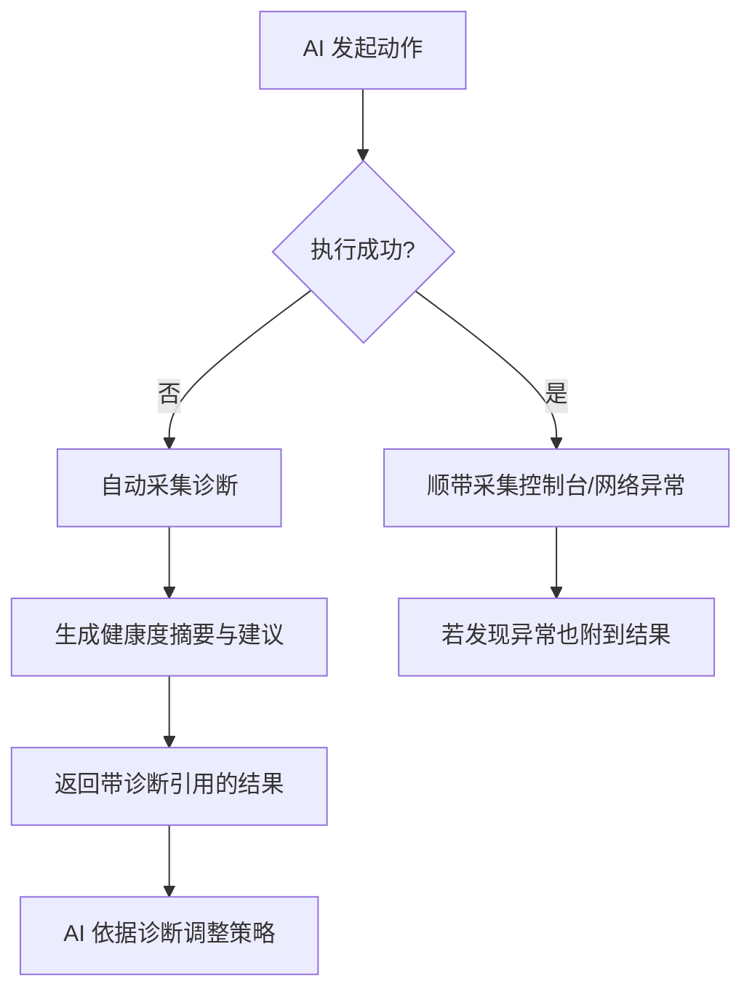

# 调试诊断中心（5 星能力）

借鉴 **Chrome DevTools MCP** 的调试诊断能力，为 AI 提供「报错即诊断」的全链路排障体验。

## 能力清单

| 维度 | 采集内容 | 用途 |
| :--- | :--- | :--- |
| 控制台 | console 消息/错误/警告 | 识别 JS 报错、资源失败 |
| 网络 | 失败请求(4xx/5xx)、慢请求(>3s)、CORS | 定位接口/资源问题 |
| JS 异常 | 未捕获异常 + 堆栈 | 定位代码崩溃点 |
| 性能 | TTFB / LCP / FCP / 长任务 / 资源体积 | 定位首屏与卡顿 |
| DOM | 元素 outline / 位置 / ARIA / 样式、白屏/未渲染/无交互检测 | 辅助精确定位与可访问性 |
| 无障碍 | ARIA / role / name | 提升可访问性与定位精度 |

## 核心流程：失败即诊断



**核心价值**：普通框架失败只返回 `action failed`，而 Forge 在失败时自动采集全量诊断，把「一次报错」变成「可行动的排障上下文」，AI 能直接据此修复。

## 使用方式

```ts
import { ForgeBrowser } from "@openliulan/core";
import { PlaywrightEngine } from "@openliulan/engines";
import { summarize } from "@openliulan/diagnosis";

const forge = new ForgeBrowser(new PlaywrightEngine(), { autoDiagnoseOnError: true });

// 失败动作会自动附带 diagnostics
const result = await forge.act({ type: "click", text: "不存在的按钮" });
console.log(result.diagnostics); // 已填充诊断

// 或主动诊断
const report = await forge.captureDiagnostics();
const summary = summarize(report);
if (!summary.healthy) {
  console.log(summary.suggestions);
}
```

## MCP 工具 `diagnose`

AI 通过 MCP 直接调用 `diagnose`，返回：

```json
{
  "content": [
    "# 诊断结果 (存在问题)",
    "- [console/error] 某 JS 报错",
    "- [network/error] 请求失败 GET https://... (404)",
    "## 建议",
    "1. 控制台有 1 条错误..."
  ],
  "structured": { "issues": [...], "console": 1, "network": 1, "dom": 0, "jsExceptions": 0 }
}
```

> DOM 采集器会检测页面是否**空白/未渲染/无可见可交互元素**（如挂载节点空、初始化 JS 报错阻断整树渲染），这类渲染级问题从 console/network 里看不到，但对 AI 排障极关键——对应「白屏」类问题的自动匹配。

## 与 DevTools MCP 的差异与互补

- DevTools MCP 直接操作浏览器调试协议，诊断能力强但偏底层、需前置连接。
- Forge 在 Playwright 基础上封装诊断，**开箱即用**，且把诊断结果直接结构化为 AI 决策输入。
- 当需要连接**真实运行中的浏览器**深度调试时，用 `connectUrl`（CDP 直连）即可复用 DevTools 调试通道。
